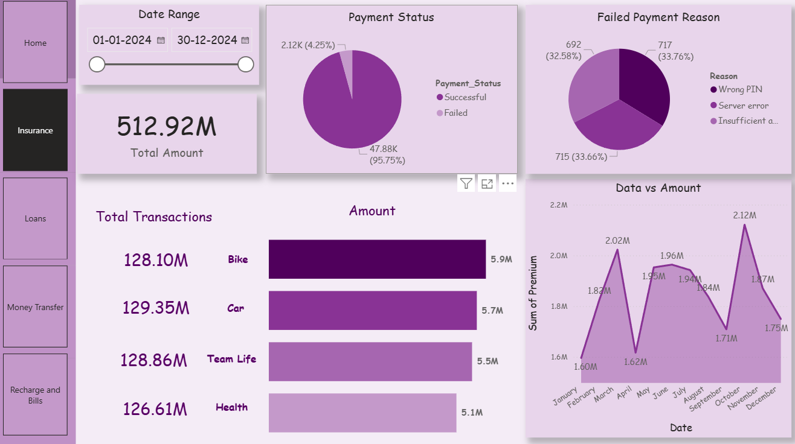
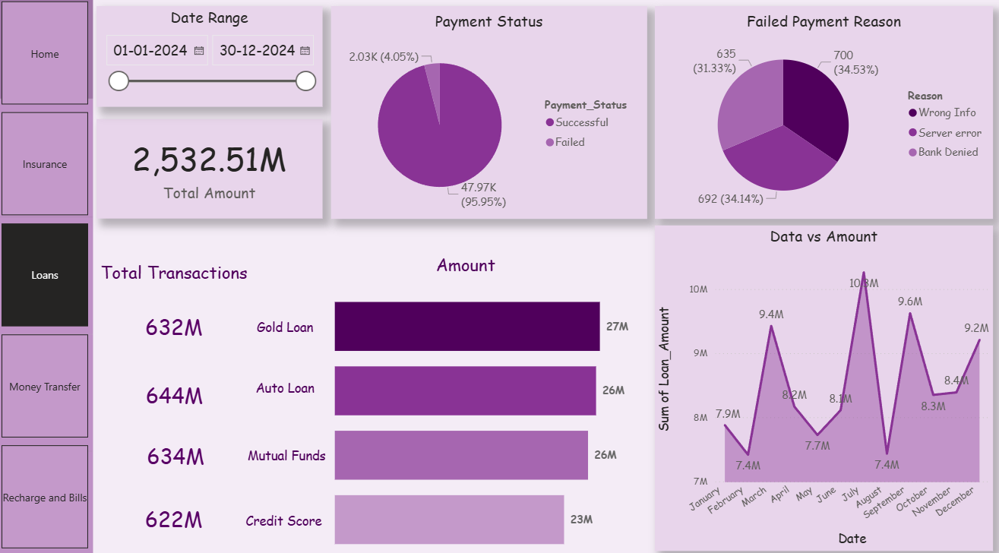

# 📊 Digital Payments Analytics Dashboard – Power BI

This repository contains an interactive **Power BI Dashboard** that visualizes insights across **Digital Payments**, **Insurance**, **Loans**, **Money Transfer**, and **Recharge & Bills** for the year **2024**.  
The dashboard helps users analyze payment activity, success/failure patterns, service performance, and monthly trends.

---

## 🚀 Project Overview

This Power BI project provides:

- Total transaction amount  
- Successful vs failed transactions  
- Service-wise total amount comparison  
- Monthly revenue trends  
- Failed payment reasons  
- Detailed dashboards for Insurance and Loans  
- Custom navigation buttons for smooth switching between reports  

---

## 🖥️ Features

### 🔹 Home Dashboard
- Total Amount  
- Successful / Failed / Total Transactions  
- Breakdown of amount by service  
- Pie chart of Failed Payment Reasons  
- Monthly trend chart (Date vs Amount)  
- Navigation panel to service dashboards  

### 🔹 Insurance Dashboard
- Total Insurance Amount  
- Payment Status (Success vs Failed)  
- Failure Reasons  
- Category Insights:
  - Bike  
  - Car  
  - Team Life  
  - Health  
- Monthly Premium Trends  

### 🔹 Loans Dashboard
- Total Loan Amount  
- Payment Status Breakdown  
- Failed Payment Reasons  
- Loan Types:
  - Gold Loan  
  - Auto Loan  
  - Mutual Funds  
  - Credit Score  
- Monthly Loan Amount Trend  

---

## 📸 Dashboard Screenshots

### Home Dashboard
 

### Insurance Dashboard
 

### Loans Dashboard

---

## 🔧 Tools Used

- Power BI Desktop  
- Power Query  
- DAX (for measures & KPIs)  
- CSV / Excel Dataset  

---

## 📥 How to Use

1. Download or clone the repository  
2. Open the `.pbix` file in **Power BI Desktop**  
3. Refresh data if needed  
4. Use date filters and navigation buttons to explore the report  

---

## 📈 Key Insights

- Loans contribute the highest overall amount  
- Insurance categories perform steadily across the year  
- Major failed transaction reasons:
  - Wrong PIN  
  - Server Error  
  - Bank Denied  
- Revenue spikes in March, July, September, and December  

---

## 🔮 Future Enhancements

- Add AI-powered forecasting  
- Add dashboards for Money Transfer & Recharge  
- Implement Row-Level Security (RLS)  
- Publish to Power BI Service with scheduled refresh  

---

## 📬 Contact

**Gorrepati Yasaswini**  
Email: yasaswinigorrepati@gmail.com  

